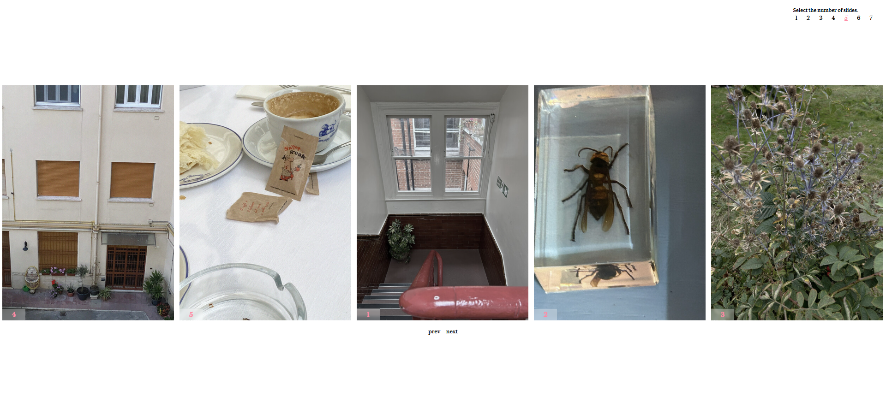

# 🎠 Vanilla Carousel
> Pure JavaScript infinite carousel with dynamic slide positioning and smooth transitions

  

[🔗 Live Demo](https://vanilla-carousel-js.netlify.app/)

---

## Features

- **No Dependencies**: Pure vanilla JavaScript
- **Infinite Loop**: Seamless circular navigation with smart cloning
- **Dynamic Slides**: Adjust 1-7 slides on the fly
- **Center Mode**: Automatic center alignment for 5+ slides
- **Responsive**: Auto-adapts to window resize

## Tech Stack

- **JavaScript (ES6+)**
- **CSS3** (Transform-based positioning)
- **SCSS**
